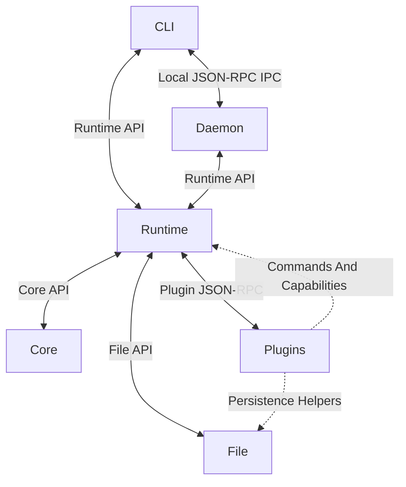

# Architecture

## Architecture Style

Crabbot uses a layered, hexagonal host/plugin architecture with a
microkernel-style core, isolated JSON-RPC plugins, and a client–daemon runtime.
The Core defines provider-neutral contracts, the Runtime provides host adapters
and lifecycle management, and plugins provide optional capabilities out of
process. This also applies dependency inversion: the Runtime depends on Core,
while Core remains independent of the Runtime and external providers.

Crabbot is organized into six layers:

1. `crabbot` is the user-facing CLI. It handles local commands and uses
   authenticated local JSON-RPC IPC when a command needs the daemon.
2. `crabbot-daemon` is the long-running service entrypoint. It starts the
   runtime and keeps the agent, state, bridges, and plugin processes alive.
3. `crabbot-runtime` is the host layer shared by the CLI and daemon. It
   owns configuration, persistence, lifecycle, installation and updates,
   session orchestration, channel bridges, and local IPC.
4. `crabbot-core` is the provider-neutral agent foundation. It owns normalized
   messages, the turn loop, policy, routing, protocol types, and plugin
   process contracts. It does not depend on the runtime.
5. `crabbot-plugins/` contains optional capabilities. Plugins are separate
   processes that communicate with the runtime through bounded JSON-RPC 2.0
   messages.
6. `crabbot-libs/file` provides private, crash-safe file primitives shared by
   the host and stateful plugins. It is a library, not a plugin process or an
   agent capability.

The `Runtime API`, `Core API`, and `File API` edges are in-process library
calls and returned values. Only CLI-to-Daemon IPC and Runtime-to-Plugin
JSON-RPC cross process boundaries. Plugins do not connect to Core at runtime;
they implement the contracts Core defines and communicate through Runtime.

The core is useful without plugins: `version`, `init`, `doctor`, `status`, and plugin
management still work. A model plugin handles `generate` with a normalized
`ModelRequest` and returns a `ModelReply`. The host is responsible for policy,
session ownership, approvals, timeouts, and durable state; model events cannot
grant their own approval. Plugins never call one another directly. Plugins may
register bounded CLI commands through JSON-RPC. Store,
memory, timer, MCP, speech, and client plugins
are explicit extension seams; only model, channel, and tool routing is enabled
in the initial daemon flow.

The runtime keeps a live registry of verified plugin processes. `plugin install`
and `plugin link` request authenticated IPC activation after committing the
plugin; `plugin remove` unloads it before deleting its files. The bridge wakes
when a configured channel or model is added, so a daemon need not restart to
discover it. `plugin update` unloads active plugin processes before replacing
their files, then reloads the same active set; inactive plugins stay inactive
and the daemon process remains running.

## Turn Flow

The host reads `CRABBOT_HOME/workspace/CRAB.md` and `CLAW.md` as bounded system
context at the start of each turn. It appends the session's bounded transcript
after that context; the instruction text is not stored in the transcript, so
file edits take effect on the next turn. The host does not inject `AGENTS.md`
into general Crabbot requests.

1. A channel plugin polls its provider and normalizes an external update into
   an event with stable IDs, sender data, room scope, text, and attachments.
2. The daemon checks channel policy, advances the channel offset, and records
   the event in its deduplication set before admitting work.
3. A new session gets a bounded transcript and, for an eligible group, an
   isolated Git worktree. Additional messages join the bounded session queue.
4. The host creates a durable lease and sends a model request through the core
   turn loop. The loop enforces step and call limits and asks the host before
   every tool invocation. Bounded model deltas are sent through a bounded
   stream queue and coalesced into channel edits at most twice per second;
   tool transitions appear as progress updates.
5. Tool results and the model reply are persisted with the transcript before
   the channel acknowledgement is committed. Delivery uses a durable outbox
   with stable IDs and explicit `pending`, `sending`, `streaming`, and
   `uncertain` states. The completed reply edits the streamed message; a
   multi-part response edits its first chunk and sends the remaining chunks.
   A transport failure is never retried automatically because the provider
   may have accepted the message.

Cancellation is terminal for the active turn. A restart can requeue only a
lease marked replay-safe; a lease that reached a mutating tool is recorded as
interrupted instead of being replayed.

## Persistence

State files are written through the shared `crabbot-file` crate. The writer fsyncs content and a
transaction journal before replacement, records each rename phase, and repairs
an interrupted transaction at the next read. Files are private on Unix and
owner-only on Windows. Discord stores its gateway sequence and session cursor
through the same path, allowing a resumed gateway session after a plugin
restart.

## Protocol

Every plugin must answer `hello` with its ID, version, protocol, and capability
list. `ping` checks health and `shutdown` requests a clean stop. Unknown calls
return JSON-RPC method-not-found. Frames are bounded to eight MiB and every
request has a numeric ID when a response is required. A model may emit bounded
JSON-RPC notifications with method `event` while a request is in flight; the
host validates and folds those normalized `Event` values into the turn before
accepting the correlated response. Notifications never replace the final
response and are discarded when malformed.

Coverage gates measure every Rust source file in the workspace. Tests use local
fixtures and mock transports so provider, channel, process, and terminal paths
remain deterministic without credentials or external services.

The protocol is stable within the 0.x series. Plugin manifests declare a
compatible range, while `plugins.lock` records the exact installed source and
permissions. Minor releases add capabilities without breaking compatible
plugins.

## Extension Rules

Add shared data types, protocol methods, and policy primitives to
`crabbot-core` only when they are provider-neutral. Put lifecycle, persistence,
IPC, and update orchestration in `crabbot-runtime`. Put network clients, credentials,
filesystem capabilities, and vendor-specific payloads in a plugin. Normalize
wire data at the plugin boundary and keep credentials out of normalized events.

Every new capability needs a manifest, a deterministic protocol test, a README
installation line, and an entry in the release matrix. Plugins must tolerate
unknown requests with a JSON-RPC error, bound every response, and shut down
their child processes when the host cancels or restarts them.

## Security

The host treats plugins as executable trust boundaries. Filesystem tools must
stay below their configured root, shell is disabled by default, and every
mutating or risky action carries approval metadata. Logs must not contain
credentials or authorization headers.
