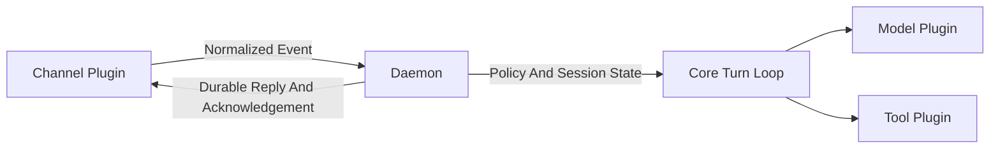

# Documentation Home

Crabbot is a local-first agent made from a small host, a capability-free core,
and replaceable process plugins. Start with the first-run workflow, then use
these guides when operating or extending an installation:

1. [Workflows](workflows.md) — first run, development, updates, and operations.
2. [Configuration](configuration.md) — paths, credentials, channel policy,
   updates, state, and recovery.
3. [Providers](providers.md) — intelligence and messaging setup.
4. [Authentication](authentication.md) — credentials and channel trust.
5. [Commands](commands.md) — CLI, daemon, session, service, and plugin flows.
6. [Concepts](concepts.md) — sessions, turns, leases, events, and delivery.
7. [Architecture](architecture.md) — process boundaries, turn flow, and JSON-RPC.
8. [Plugins](plugins.md) — manifests, sources, permissions, and authoring.
9. [Safety](safety.md) — defaults, confinement, recovery, and resource limits.
10. [Security](security.md) — trust boundaries, approvals, and operational limits.
11. [Troubleshooting](troubleshooting.md) — diagnostics and common failures.
12. [Release](release.md) — packaging, checksums, and publication gates.
13. [License](license.md) — Apache-2.0 rationale and contribution terms.
14. [Product](product.md) — capabilities, boundaries, and engineering principles.
15. [Acceptance](acceptance.md) — deterministic product and release flows.

## Request Flow



The daemon owns authorization, leases, delivery state, and operator-controlled
recovery. Plugins receive normalized protocol values and never call one another
directly. Keep plugin stdout reserved for JSON-RPC frames; write diagnostics to
stderr.

## Local Development

```sh
lefthook install
make verify
```

Tests use deterministic local fixtures. They do not call paid provider APIs.
Before opening a pull request, update the relevant guide and run the complete
verification workflow, including the 80% core and host package line-coverage gate.
